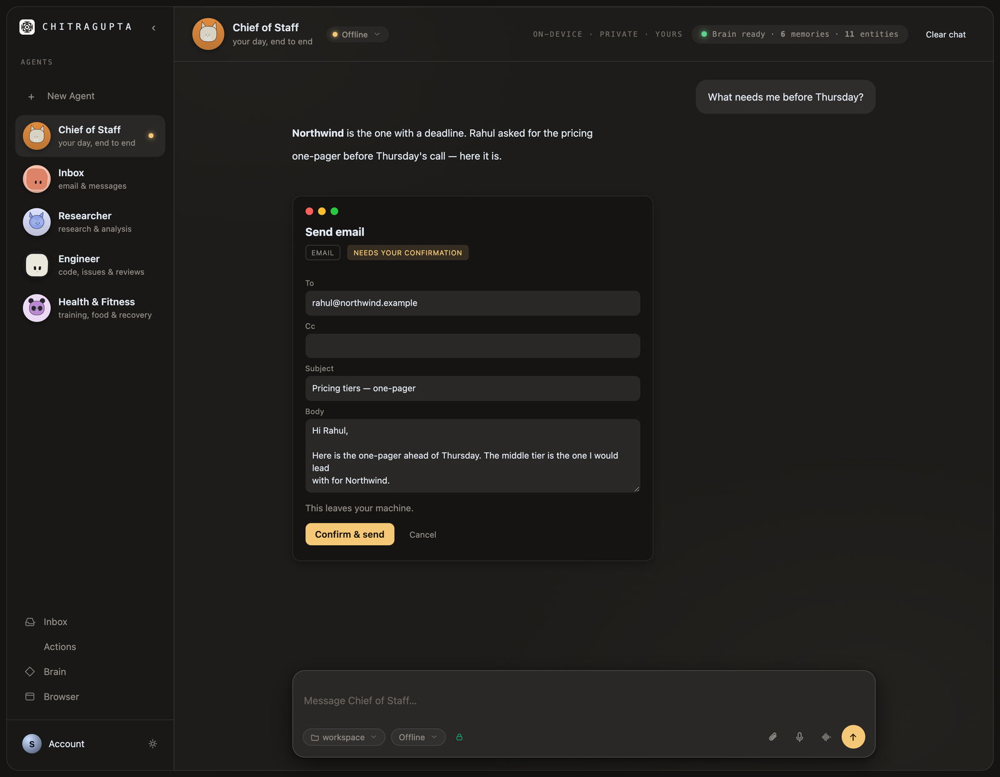
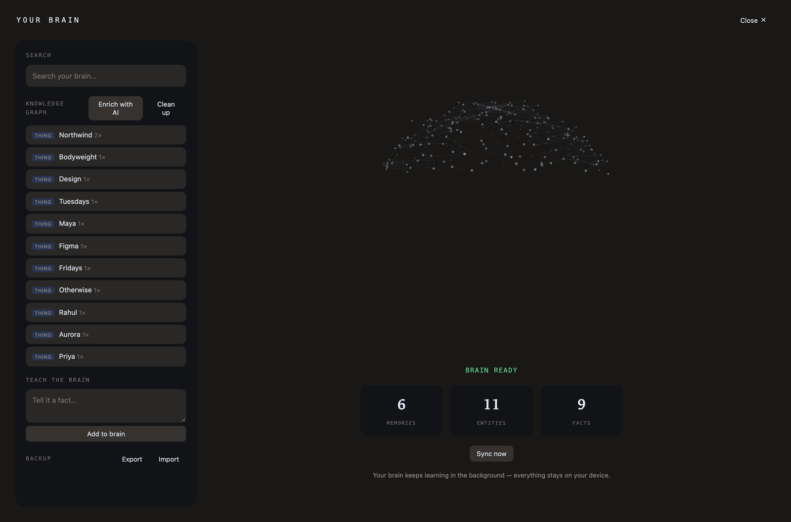
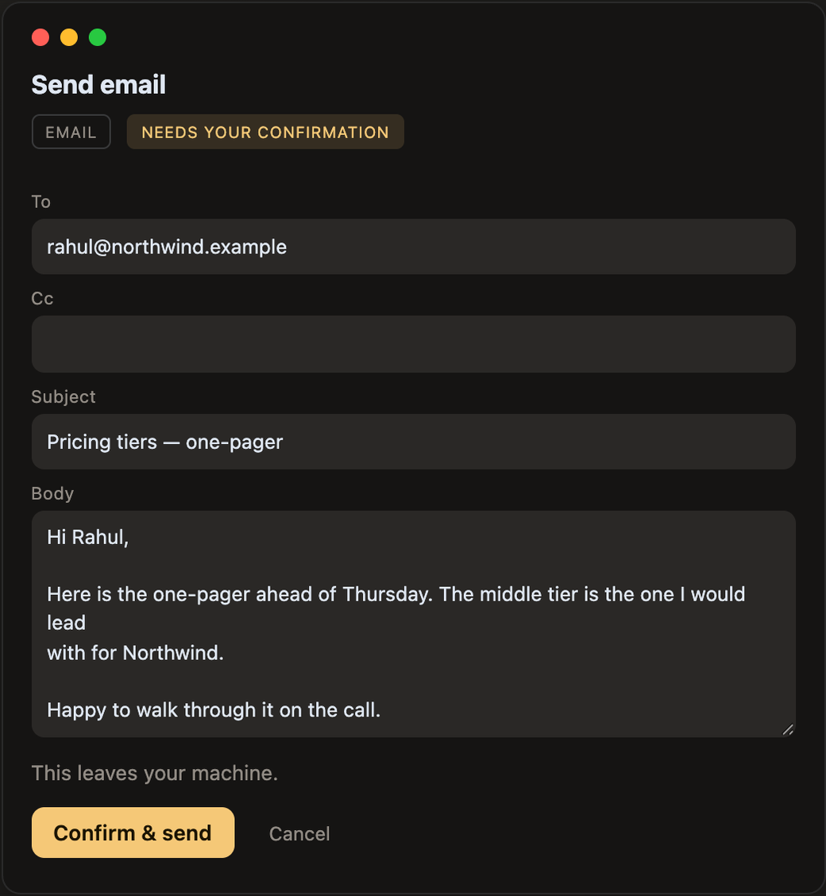
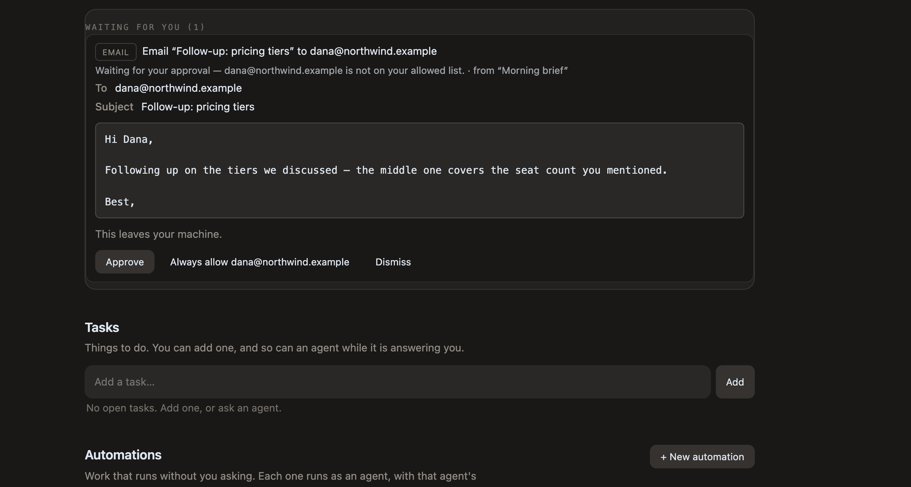

<div align="center">

<picture>
  <source media="(prefers-color-scheme: dark)" srcset="docs/assets/logo-dark.png">
  
</picture>

# Chitragupta

**A team of AI agents that share one brain — and it lives on your Mac.**

Connect your mail, files, calendar and notes. They become a knowledge graph on
your own disk. Then a team of agents works from it, using whichever model you
already pay for, and asks you before it touches anything outside your machine.

[](https://github.com/suryansh2846code/chitragupta/actions/workflows/ci.yml)
[](LICENSE)
[](docs/DISTRIBUTION.md)
[](pyproject.toml)

</div>

<br>



<br>

> **Chitragupta** — in Hindu tradition, the scribe who keeps the record of what
> each person has actually done. A fitting name for an app whose whole job is to
> remember your work and always be able to say where a fact came from.

---

## Why this exists

Every AI tool starts from zero. You explain your projects, your people and your
preferences again, in every new chat, to every new assistant — and the moment
you close the tab it is all gone.

Chitragupta keeps that context **on your machine**, in a form every agent can
read, and gives you a team rather than a single chatbot:

| | |
|---|---|
| 🧠 **One brain, many agents** | Memories *and* an entity/relation graph, built locally from your own sources. Every agent reads the same one, so you explain yourself once. |
| 🔌 **Bring your own model** | Claude, GPT, Gemini, Grok, DeepSeek, OpenRouter, local Ollama — or a plan you already pay for. Swap any time; a stored model id is re-checked before use, never trusted. |
| ✋ **It asks before it acts** | Reading is free. Anything that leaves your machine stops at a card you can read, correct and confirm — or a queue, if an agent proposed it while you were away. |
| 🔒 **Local-first, no telemetry** | Everything in `~/Library/Chitragupta`. No cloud copy, no account, no analytics. Works offline with zero keys. |

---

## What it looks like

### The brain

Your sources become memories *and* a graph of the people, projects and facts in
them. Recall fuses both into the context an agent starts a turn with — so it
begins already knowing who Priya is and what Aurora depends on.



### Nothing leaves without your say-so

An agent that wants to send, share or change something proposes it. You get a
card with **the actual content**, every field editable, and what runs is what is
on the card when you press Confirm — never what the model first wrote.



### Including while you are away

An agent working unattended cannot quietly widen its own permissions. It stops,
and the request waits — showing the **whole** thing, not a summary, because you
cannot consent to text you were never shown.



---

## Install

```bash
git clone https://github.com/suryansh2846code/chitragupta.git
cd chitragupta
uv venv && uv pip install -e ".[desktop]"
chitragupta app
```

That is enough to open it. It runs offline out of the box — a deterministic
`mock` model and hash embeddings mean **no keys are required to try it**. Add a
real model when you want real answers.

<details>
<summary><b>Other ways in</b></summary>

```bash
uv pip install -e .            # core only, no native window
uv pip install -e ".[all]"     # + real embeddings and every connector SDK
chitragupta serve              # browser at http://127.0.0.1:8787 instead of a window
```

One-line install for testers on macOS:

```bash
curl -LsSf https://raw.githubusercontent.com/suryansh2846code/chitragupta/main/scripts/install.sh | bash
cd ~/chitragupta && .venv/bin/chitragupta app
```

A signed, notarised `.dmg` is built by `scripts/build-dmg.sh` — see
[`docs/DISTRIBUTION.md`](docs/DISTRIBUTION.md).
</details>

<details>
<summary><b>The CLI</b></summary>

```bash
chitragupta agents                                  # your team
chitragupta ingest --text "We deploy on Fridays."   # teach the brain
chitragupta ingest --path ~/Documents/notes         # …or a file or folder
chitragupta chat research "what do I build?"        # ask one agent
chitragupta recall "aurora"                         # what the brain would inject
chitragupta stats                                   # brain + graph counts
chitragupta providers                               # model backends & readiness
```
</details>

<details>
<summary><b>Use the brain from your terminal, too</b></summary>

The same brain is an MCP server, so Claude Code or Cursor can search it without
leaving the terminal:

```bash
chitragupta mcp-install     # prints the one line to paste
```
</details>

---

## Bring your own model

Chosen per agent in the app, or set `CHITRAGUPTA_MODEL_PROVIDER` in `.env`.

| provider | what it is | how |
|---|---|---|
| `mock` | offline and deterministic — the default, so it runs before you decide | nothing |
| `claude` | Claude | `ANTHROPIC_API_KEY`, or sign in to your account |
| `openai` | GPT | `OPENAI_API_KEY` |
| `gemini` | Gemini | `GEMINI_API_KEY` |
| `xai` | Grok | `XAI_API_KEY`, or your subscription via xAI's CLI |
| `deepseek` | DeepSeek | `DEEPSEEK_API_KEY` |
| `openrouter` | hundreds of models behind one key | `OPENROUTER_API_KEY` |
| `ollama` | free local models, nothing leaves the machine | Ollama on `:11434` |
| `claude-code` · `cursor` | plans you already pay for, run through their own CLIs | Chitragupta downloads and pins the CLI for you |
| `subscription` | any OpenAI-compatible gateway | `CHITRAGUPTA_SUBSCRIPTION_BASE_URL` |

**We never ask you to open a terminal.** Where a vendor only exposes a CLI, the
app downloads it, pins it and signs you in with one button.

**Availability is resolved per account, never hardcoded.** What a provider says
*your* key can reach beats any shipped list, so the picker never offers a model
that 404s when you select it.

---

## Connectors

**Local — no sign-in, just Full Disk Access:** Files · Notes · Apple Mail ·
Apple Calendar · iMessage · Apple Health

**Signed in:** Gmail · Google Calendar · Google Drive · Notion · GitHub · Slack ·
Linear · Telegram

**Anything else** is reached over **MCP** (`mcp:<id>`) or as a user-described API
app (`custom:<id>`).
[`docs/REACHING-AN-APP.md`](docs/REACHING-AN-APP.md) explains which route a given
app takes.

Sync is **read-only**. Agents can also *act* — send mail, triage an inbox, write
to a connected app — and every one of those is tiered in `actions.py` and gated
in `agents/permissions.py`: it either names a recipient you put on an allow-list,
or it waits for one tap.

---

## How it is built

```
        ┌──────────────── workspace (vanilla JS, no build step) ───────────────┐
        │   agent rail  ·  conversation + tool trace  ·  brain  ·  approvals   │
        └───────────────────────────────┬──────────────────────────────────────┘
                                        │  FastAPI, loopback only
            ┌───────────────────────────┼───────────────────────────┐
            ▼                           ▼                           ▼
     ┌─────────────┐            ┌──────────────┐            ┌──────────────┐
     │   agents    │            │    models    │            │    brain     │
     │  turn loop  │◀──tools───▶│  BYO: claude │            │  memories    │
     │  delegation │            │  openai/…    │            │  + graph     │
     │  approvals  │            │  entitlements│            │  (SQLite)    │
     └──────┬──────┘            └──────────────┘            └──────▲───────┘
            │                                                      │
            │                   ┌──────────────┐                   │
            └──────────────────▶│  connectors  │──────ingest───────┘
                                │ one per app  │
                                └──────────────┘
```

Everything runs on your machine. The server binds loopback; the desktop window is
a WKWebView around the same page.

**Reading the code?** Start with
[`docs/ARCHITECTURE.md`](docs/ARCHITECTURE.md) — who owns what, which way
dependencies may run, and the invariants that are load-bearing even when the
tests are green. Every code directory has its own `CLAUDE.md` narrowing those
rules for that directory.

| | |
|---|---|
| **What this is, from scratch** | [`docs/PROJECT.md`](docs/PROJECT.md) · [`docs/CONCEPTS.md`](docs/CONCEPTS.md) |
| **The agent loop** | [`docs/AGENTS.md`](docs/AGENTS.md) |
| **The brain's data model** | [`docs/BRAIN-V1.5.md`](docs/BRAIN-V1.5.md) · [`docs/SCALING.md`](docs/SCALING.md) |
| **Connectors** | [`docs/CONNECTOR-PLATFORM.md`](docs/CONNECTOR-PLATFORM.md) · [`docs/development/writing-a-connector.md`](docs/development/writing-a-connector.md) |
| **Automations** | [`docs/AUTOMATION.md`](docs/AUTOMATION.md) |
| **Models, auth, errors** | [`docs/development/models.md`](docs/development/models.md) |
| **The macOS window** | [`docs/DESKTOP-SIGNIN.md`](docs/DESKTOP-SIGNIN.md) |
| **Why a decision was made** | [`docs/DECISIONS.md`](docs/DECISIONS.md) · [`docs/JOURNEY.md`](docs/JOURNEY.md) |
| **Known gaps** | [`docs/AUDIT.md`](docs/AUDIT.md) |

---

## Development

```bash
pytest                              # 5403 passing, ~7 min
ruff check chitragupta tests
mypy chitragupta
```

Frontend render paths are executed in node against the real `app.js`
(`tests/js/`), because `node --check` and source-order assertions both pass while
a temporal-dead-zone error or a detached container has broken the screen.

Two rules worth knowing before you send a patch, both bought the hard way:

- **A bug fix ships with a test that fails without it — and you have to watch it
  fail.** Reintroduce the bug, confirm red, restore. A test written after the fix
  and never seen red is a guess about what it covers.
- **Fix the shape, not the instance.** A bug reported about one card is a report
  about every card that shares its shape.

The full set is in [`CLAUDE.md`](CLAUDE.md).

---

## Roadmap

- [x] iMessage · Linear · Slack · GitHub · Telegram · Apple Health connectors
- [x] Streaming chat, and action cards you can correct before confirming
- [x] Custom agents, and a library to start from
- [x] Automations — work that runs without you asking, with durable runs
- [x] Native macOS window, signed and notarised `.dmg`
- [ ] Browser-history and meeting-notes connectors
- [ ] Continuous background indexing (watch folders and inboxes)

---

## License

[Apache-2.0](LICENSE)

<div align="center">
<sub>Built to run on your machine, and to be able to say where every fact came from.</sub>
</div>
